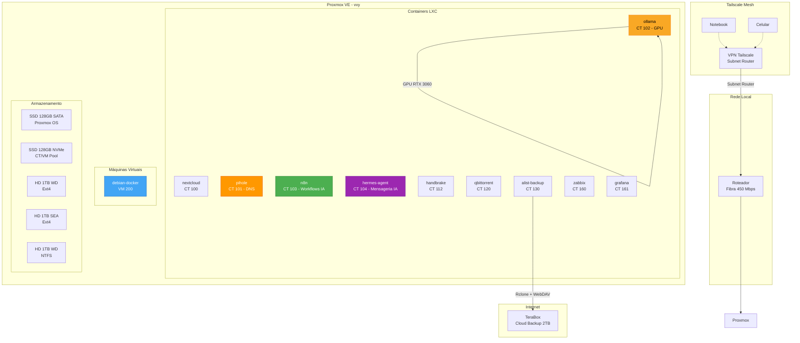

# vvy-homelab

Home Lab baseado no **Proxmox VE**, projetado para centralizar serviços de infraestrutura de rede, armazenamento em nuvem privada e execução local de modelos de IA (LLMs via Ollama com GPU passthrough). Atua como núcleo de processamento para tarefas que exigem disponibilidade 24/7, permitindo que o notebook principal seja utilizado apenas para interface de trabalho e criação.

---

## Arquitetura do Homelab

---

## Documentacao

| Documento | Descricao |
|---|---|
| [Hardware](docs/hardware.md) | Especificacoes do servidor (Xeon E5-2470 v2, RAM, SSDs) e do cliente |
| [Proxmox Setup](docs/proxmox-setup.md) | Virtualizacao Proxmox 9.1.6, containers LXC e VMs |
| [Storage](docs/storage.md) | HDs de dados, pontos de montagem e UUIDs |
| [Networking](docs/networking.md) | VPN Tailscale, nos, subnet router e acesso remoto |
| [Backup](docs/backup.md) | Sistema automatizado Alist + Rclone + TeraBox |
| [Monitoring - Zabbix](docs/monitoring-zabbix.md) | Zabbix 7.2, hosts monitorados e thresholds |
| [Monitoring - Grafana](docs/monitoring-grafana.md) | Grafana 12.4 + Prometheus + Node Exporter |
| [Scripts](docs/scripts.md) | Scripts de telemetria e automacao |
| [Admin Remoto](docs/admin-remote.md) | VS Code Remote SSH e boas praticas |
| [AI - Ollama](docs/ai-ollama.md) | Ollama, GPU passthrough RTX 3060, Modelfiles |
| [AI - Integracao](docs/ai-integration.md) | Cline e Continue (VS Code) conectados ao Ollama |
| [Docker VM](docs/docker-vm.md) | VM Debian 12 com Docker e Portainer |
| [n8n Workflows](docs/n8n-workflows.md) | Oquestracao de workflows IA com n8n |
| [Hermes Agent](docs/hermes-agent.md) | Gateway de mensageria IA (WhatsApp, Slack) - CT 104 |
| [Terraform](docs/terraform-proxmox.md) | Infraestrutura como Codigo - provisionamento Proxmox |
| [Ansible](docs/ansible-proxmox.md) | Configuracao como Codigo - automacao de tarefas |

---

## Scripts

| Script | Descricao |
|---|---|
| [`scripts/monitor.sh`](scripts/monitor.sh) | Telemetria do servidor - temperatura CPU, RAM e load average |
| [`scripts/scripts-server-freeze/`](scripts/scripts-server-freeze/) | Kit de diagnostico de travamento - watchdog, diagnostico pos-reboot e instalador |

---

## Licenca

Este projeto esta licenciado sob a [MIT License](LICENSE).
