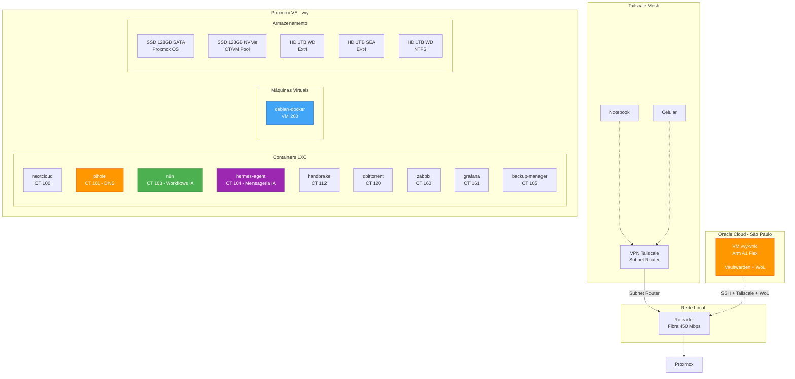

# vvy-homelab

Home lab baseado no **Proxmox VE**, projetado para centralizar serviços de
infraestrutura de rede e armazenamento em nuvem privada. Atua como núcleo
de processamento para tarefas que exigem disponibilidade 24/7, permitindo
que o notebook principal seja utilizado apenas para interface de trabalho
e criação.

---

## Arquitetura do Homelab

---

## Documentação

| Documento | Descrição |
|---|---|
| [Hardware](docs/hardware.md) | Especificações do servidor (Xeon E5-2470 v2, RAM, SSDs) e do cliente |
| [Proxmox Setup](docs/proxmox-setup.md) | Virtualização Proxmox VE 9.2.5, containers LXC e VMs |
| [Storage](docs/storage.md) | HDs de dados, pontos de montagem e UUIDs |
| [Networking](docs/networking.md) | VPN Tailscale, nós, subnet router e acesso remoto |
| [Backup](docs/backup.md) | Sistema de backup — rclone + Google Drive 2TB (CT 105) |
| [Monitoring - Zabbix](docs/monitoring-zabbix.md) | Zabbix 7.2, hosts monitorados e thresholds |
| [Monitoring - Grafana](docs/monitoring-grafana.md) | Grafana 12.4 + Prometheus + Node Exporter |
| [Scripts](docs/scripts.md) | Scripts de telemetria e automação |
| [Docker VM](docs/docker-vm.md) | VM Debian 12 com Docker e Portainer |
| [n8n Workflows](docs/n8n-workflows.md) | Orquestração de workflows IA com n8n |
| [Hermes Agent](docs/hermes-agent.md) | Gateway de mensageria IA (Telegram) + backend remoto via Tailscale (Desktop App) — CT 104 |
| [Terraform](docs/terraform-proxmox.md) | Infraestrutura como Código — provisionamento Proxmox |
| [Ansible](docs/ansible-proxmox.md) | Configuração como Código — automação de tarefas |
| [Oracle Cloud](docs/oracle-cloud.md) | VM vvy-vnic na Oracle Cloud Free Tier — Arm A1 Flex, extensão remota do homelab |
| [BIOS vvy](docs/bios-vvy.md) | Configuração completa da BIOS QIYIDA X79 — C-states, power limits, QPI, ACPI |

---

## Scripts

| Script | Descrição |
|---|---|
| [`scripts/monitoring/server-watchdog.sh`](scripts/monitoring/server-watchdog.sh) | Telemetria do servidor — memória, CPU, disco, rede. Cron a cada 1 min |
| [`scripts/server-freeze/`](scripts/server-freeze/) | Kit de diagnóstico de travamento — watchdog, diagnóstico pós-reboot e instalador |
| [`scripts/sync/`](scripts/sync/) | Sincronização privado → público (sync_public.py) |
| [`scripts/monitoring/vvy-healthcheck-unified.sh`](scripts/monitoring/vvy-healthcheck-unified.sh) | Healthcheck + MCE/EDAC unificados — cronjob Hermes a cada 2h (no_agent=True, script-only) |
