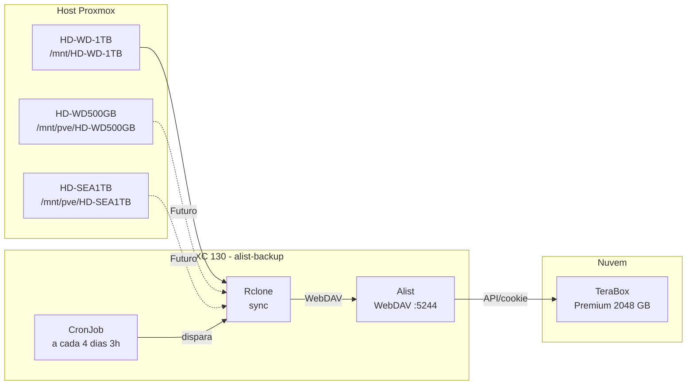

# Sistema de Backup Automatizado

> **Versão:** Abril/2026 | **Autor:** Vinícius Souza

---

## 1. Sistema de Backup Automatizado (Alist + Rclone + TeraBox)

### Diagrama do Fluxo de Backup

|Componente|Função|
|---|---|
|Alist|Conecta ao TeraBox via cookie/API e expõe como WebDAV na porta 5244|
|Rclone|Realiza o sync entre os HDs locais e o TeraBox via WebDAV do Alist|
|CronJob|Agendamento automático a cada 4 dias às 3h da manhã – dentro do LXC 130|

**CronJob:** `0 3 */4 * * /root/backup-terabox.sh`

**Capacidade TeraBox:** Plano Premium

- **Total:** 2048 GB

- **Usado:** ~168 GB

- **Disponível:** ~1880 GB

> O cookie do TeraBox expira periodicamente. Quando expirado, o Rclone retorna erro `403 Forbidden`. Renovar manualmente em `http://<ALIST_IP>:5244`

### Estrutura de Destino no TeraBox

|Caminho|Status|
|---|---|
|Terabox/backup-server/HD-WD-1TB/|Ativo|
|Terabox/backup-server/HD-WD-500GB/|Futuro|
|Terabox/backup-server/HD-SEA-1TB/|Futuro|
|Terabox/backup-server/PROXMOX-SYSTEM/|Futuro|
