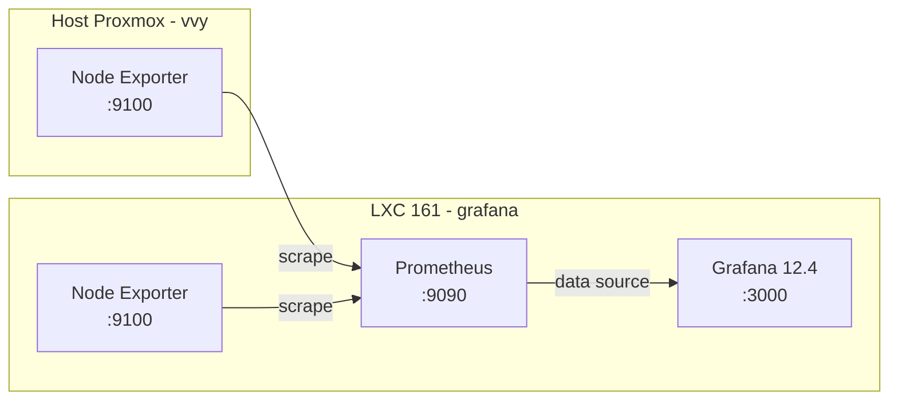

# Monitoramento de Infraestrutura (Grafana + Prometheus)

> **Versão:** Abril/2026 | **Autor:** Vinícius Souza

---

## 9. Monitoramento de Infraestrutura (Grafana + Prometheus)

### Diagrama do Stack de Monitoramento

|Componente|Versão|Porta|Função|
|---|---|---|---|
|Grafana|12.4.2|3000|Dashboard visual – acesso via navegador|
|Prometheus|via apt Debian|9090|Banco de séries temporais – coleta e armazena métricas|
|Node Exporter|via apt Debian|9100|Agente de coleta – instalado no VVY e no container 161|

### URLs de Acesso

- **Grafana:** `http://<GRAFANA_IP>:3000` (usuário: `<GRAFANA_ADMIN_USER>`)

- **Prometheus UI:** `http://<GRAFANA_IP>:9090`

### Targets Prometheus

|Job|Endpoint|Alvo|Status|
|---|---|---|---|
|prometheus|localhost:9090|Próprio Prometheus|UP|
|node_exporter_grafana|localhost:9100|Container 161 (grafana)|UP|
|node_exporter_vvy|`<HOST_IP>`:9100|Host Proxmox VVY|UP|
