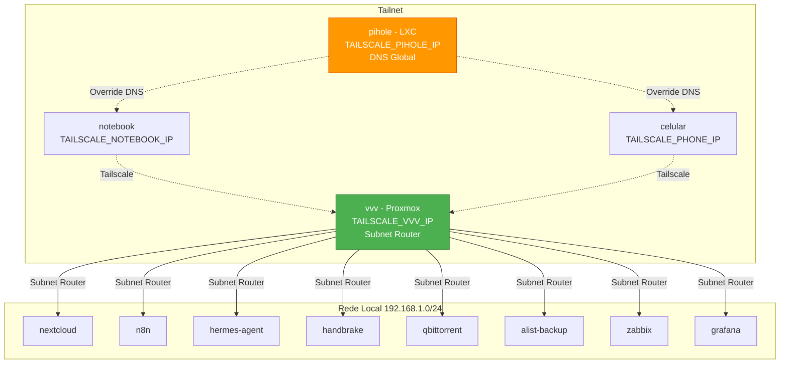

# VPN de Malha (Tailscale)

> **Versão:** Abril/2026 | **Autor:** Vinícius Souza

---

## 1. VPN de Malha (Tailscale)

### Diagrama da Rede Tailscale

### Configurações Globais

|Configuração|Valor|
|---|---|
|Gerenciamento DNS|`--accept-dns=false` em todos os nós|
|DNS global da tailnet|Pi-hole – `<TAILSCALE_PIHOLE_IP>` (Override local DNS ativo)|
|DERP mais próximo|São Paulo (sao) – Latência: 35.8ms – UDP: Ativo|

### Nós Tailscale

|Dispositivo|IP Tailscale|Tipo|Observação|
|---|---|---|---|
|vvv (Proxmox)|`<TAILSCALE_VVV_IP>`|Servidor principal|Subnet Router ativo – anuncia 192.168.1.0/24|
|pihole (LXC)|`<TAILSCALE_PIHOLE_IP>`|Container|DNS global da tailnet (Override local DNS)|
|vinimau (Notebook)|`<TAILSCALE_NOTEBOOK_IP>`|PC cliente|—|
|samsung-sm-s921b|`<TAILSCALE_PHONE_IP>`|Celular|—|

### Acesso via Tailscale por Container

|Container|URL de Acesso|Método|
|---|---|---|
|nextcloud (100)|`http://<NEXTCLOUD_IP>`|Subnet Router|
|pihole (101)|`http://<PIHOLE_IP>/admin`|Subnet + nó próprio|
|n8n (103)|`http://<N8N_IP>:5678`|Subnet Router|
|hermes-agent (104)|`<HERMES_IP>`|Subnet Router|
|handbrake (112)|`http://<HANDBRAKE_IP>:5800`|Subnet Router|
|qbittorrent (120)|`http://<QBITTORRENT_IP>:8080`|Subnet Router|
|alist-backup (130)|`http://<ALIST_IP>:5244`|Subnet Router|
|zabbix (160)|`http://<ZABBIX_IP>/zabbix`|Subnet Router|
|grafana (161)|`http://<GRAFANA_IP>:3000`|Subnet Router|
