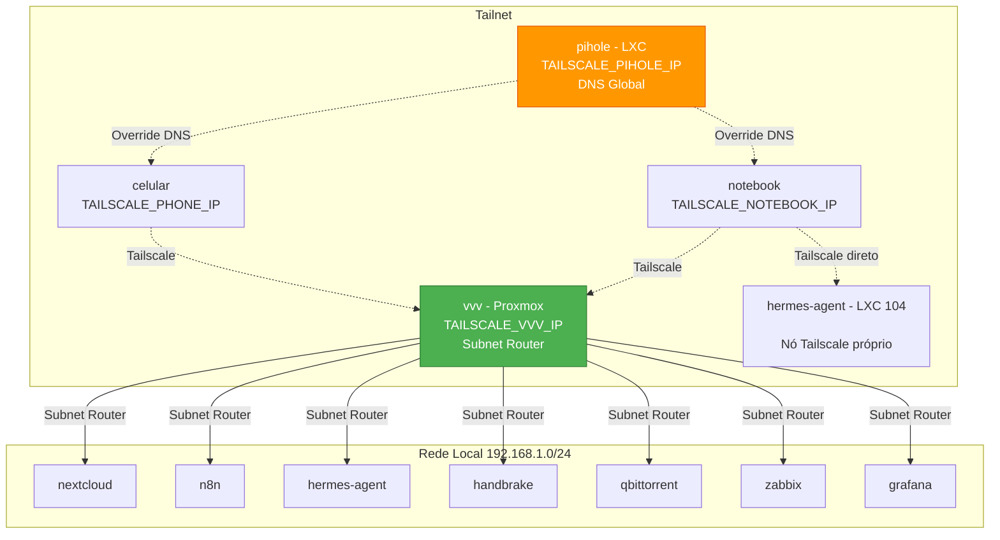

# VPN de Malha (Tailscale)

> **Versão:** Abril/2026 | **Autor:** Vinícius Souza

---

## 1. VPN de Malha (Tailscale)

### Diagrama da Rede Tailscale

### Configurações Globais

|Configuração|Valor|
|---|---|
|Gerenciamento DNS|`--accept-dns=false` em todos os nós|
|DNS global da tailnet|Pi-hole – `<TAILSCALE_PIHOLE_IP>` (Override local DNS ativo)|
|DERP mais próximo|São Paulo (sao) – Latência: 35.8ms – UDP: Ativo|

### Nós Tailscale

|Dispositivo|IP Tailscale|Tipo|Observação|
|---|---|---|---|
|vvv (Proxmox)|`<TAILSCALE_VVV_IP>`|Servidor principal|Subnet Router ativo – anuncia 192.168.1.0/24|
|pihole (LXC)|`<TAILSCALE_PIHOLE_IP>`|Container|DNS global da tailnet (Override local DNS)|
|hermes-agent (LXC 104)|`<TAILSCALE_HERMES_IP>`|Container|Nó Tailscale direto no LXC — acesso ao hermes-serve sem hop|
|vinimau (Notebook)|`<TAILSCALE_NOTEBOOK_IP>`|PC cliente|Conecta ao hermes-serve via Tailscale|
|samsung-sm-s921b|`<TAILSCALE_PHONE_IP>`|Celular|—|
|vvy-vnic (Oracle VM)|`<TAILSCALE_ORACLE_VM_IP>`|VM Cloud|Arm A1 Flex — `--accept-routes` ativo, enxerga LAN 192.168.1.0/24|

### Acesso via Tailscale por Container

|Container|URL de Acesso|Método|
|---|---|---|
|nextcloud (100)|`http://<NEXTCLOUD_IP>`|Subnet Router|
|pihole (101)|`http://<PIHOLE_IP>/admin`|Subnet + nó próprio|
|n8n (103)|`http://<N8N_IP>:5678`|Subnet Router|
|hermes-agent (104)|`http://<TAILSCALE_HERMES_IP>:9119`|Nó Tailscale próprio (Basic Auth)|
|handbrake (112)|`http://<HANDBRAKE_IP>:5800`|Subnet Router|
|qbittorrent (120)|`http://<QBITTORRENT_IP>:8080`|Subnet Router|
|zabbix (160)|`http://<ZABBIX_IP>/zabbix`|Subnet Router|
|grafana (161)|`http://<GRAFANA_IP>:3000`|Subnet Router|

## 2. DNS Dinamico (ddclient — NO-IP)

O vvy roda `ddclient` para manter o `vvy-server.ddns.net` atualizado quando o IP publico de casa muda.

|Item|Valor|
|---|---|
|Pacote|`ddclient` 3.11.2 (apt, no host vvy)|
|Config|`/etc/ddclient.conf`|
|Servico|`ddclient.service` (systemd, habilitado no boot)|
|Intervalo|300s (5 min)|
|Protocolo|NO-IP (`protocol=noip`)|
|Detecao de IP|`use=web, web=checkip.dyndns.org`|
|Hostname|`vvy-server.ddns.net`|
|Login (DDNS Key)|`<NOIP_DDNS_KEY_USER>`|
|Senha (DDNS Key)|`<NOIP_DDNS_KEY_PASSWORD>`|

> Ver doc dedicado: [Wake-on-LAN](wake-on-lan.md) para detalhes de WoL, scripts na Oracle VM e troubleshooting.

## 3. Wake-on-LAN (WoL)

O vvy suporta WoL (magic packet) na interface fisica `nic0` (MAC `<VVY_MAC>`). O roteador faz port forwarding da porta 9 UDP para broadcast `192.168.1.255` na LAN. A Oracle VM pode acordar e reiniciar o vvy remotamente via DDNS + port forwarding.

> Ver doc dedicado: [Wake-on-LAN](wake-on-lan.md)
