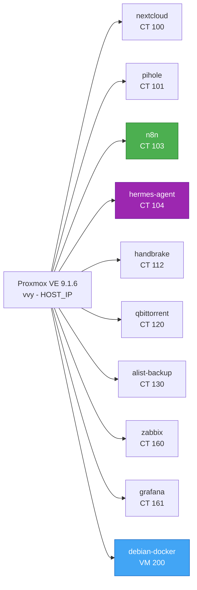

# Virtualização Proxmox

> **Versão:** Abril/2026 | **Autor:** Vinícius Souza

---

## 1. Virtualização (Proxmox 9.1.6)

- **IP Host Local:** `<HOST_IP>`

- **Kernel:** `6.17.13-6-pve` (kernel 7.0 removido)

### Diagrama da Arquitetura Proxmox

### Containers LXC

|ID|Nome|IP|Cores|Storage|Serviço|
|---|---|---|---|---|---|
|100|nextcloud|`<NEXTCLOUD_IP>`|2|HD-WD500GB|Nextcloud – nuvem privada|
|101|pihole|`<PIHOLE_IP>`|2|local-lvm|Pi-hole – DNS/bloqueio anúncios|
|103|n8n|`<N8N_IP>`|4|nvme128:20G|n8n – orquestração de workflows IA|
|104|hermes-agent|`<HERMES_IP>`|4|nvme128:16G|Hermes Agent – gateway de mensageria IA|
|112|handbrake|`<HANDBRAKE_IP>`:5800|2|local-lvm|Handbrake – transcodificação|
|120|qbittorrent|`<QBITTORRENT_IP>`:8080|6|local-lvm|qBittorrent – cliente torrent|
|130|alist-backup|`<ALIST_IP>`|2|local-lvm|Alist + Rclone – backup TeraBox|
|160|zabbix|`<ZABBIX_IP>`|2|local-lvm (20GB)|Zabbix 7.2 – monitoramento|
|161|grafana|`<GRAFANA_IP>`|2|local-lvm (10GB)|Grafana 12.4 + Prometheus + Node Exporter|

### Máquinas Virtuais

|ID|Nome|Storage|Uso|
|---|---|---|---|
|200|debian 12.12 (Bookworm)|nvme128|docker|
