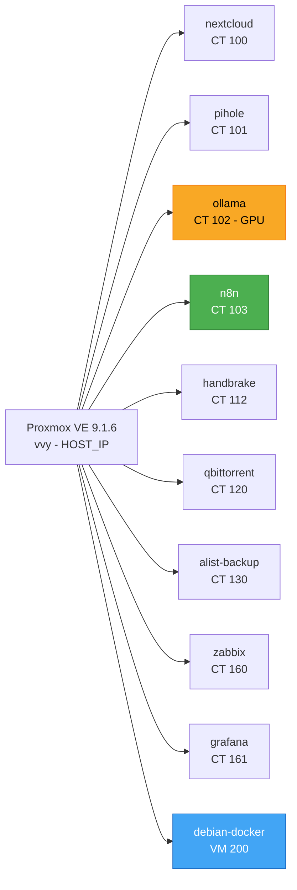

# Virtualização Proxmox

> **Versão:** Abril/2026 | **Autor:** Vinícius Souza

---

## 1. Virtualização (Proxmox 9.1.6)

- **IP Host Local:** `<HOST_IP>`

- **Kernel:** `6.17.13-2-pve`

### Diagrama da Arquitetura Proxmox

### Containers LXC

|ID|Nome|IP|Cores|Storage|Serviço|
|---|---|---|---|---|---|
|100|nextcloud|`<NEXTCLOUD_IP>`|2|HD-WD500GB|Nextcloud – nuvem privada|
|101|pihole|`<PIHOLE_IP>`|2|local-lvm|Pi-hole – DNS/bloqueio anúncios|
|102|ollama|`<OLLAMA_IP>`|8|nvme128:32G|Ollama – LLM local com GPU passthrough|
|**103**|**n8n**|**`<N8N_IP>`**|**4**|**nvme128:20G**|**n8n – orquestração de workflows IA**|
|112|handbrake|`<HANDBRAKE_IP>`:5800|2|local-lvm|Handbrake – transcodificação|
|120|qbittorrent|`<QBITTORRENT_IP>`:8080|6|local-lvm|qBittorrent – cliente torrent|
|130|alist-backup|`<ALIST_IP>`|2|local-lvm|Alist + Rclone – backup TeraBox|
|160|zabbix|`<ZABBIX_IP>`|2|local-lvm (20GB)|Zabbix 7.2 – monitoramento|
|161|grafana|`<GRAFANA_IP>`|2|local-lvm (10GB)|Grafana 12.4 + Prometheus + Node Exporter|

> **Container de IA** – Adicionado em Abril/2026

### LXC 102 — ollama (Privilegiado | GPU Passthrough)

|Parâmetro|Valor|
|---|---|
|rootfs|nvme128:32G|
|Cores|8|
|Memory|8192 MB|
|Swap|2048 MB|
|IP|`<OLLAMA_IP>`/24|
|unprivileged|0 (privilegiado – necessário para GPU passthrough)|
|GPU Passthrough|nvidia0, nvidiactl, nvidia-modest, nvidia-uvm, nvidia-uvm-tools|

> O LXC 102 é privilegiado (`unprivileged: 0`) pois o GPU passthrough de dispositivos NVIDIA (`/dev/nvidia*`) requer acesso direto ao hardware, incompatível com containers não-privilegiados.

### Máquinas Virtuais

|ID|Nome|Storage|Uso|
|---|---|---|---|
|200|debian 12.12 (Bookworm)|nvme128|docker|
