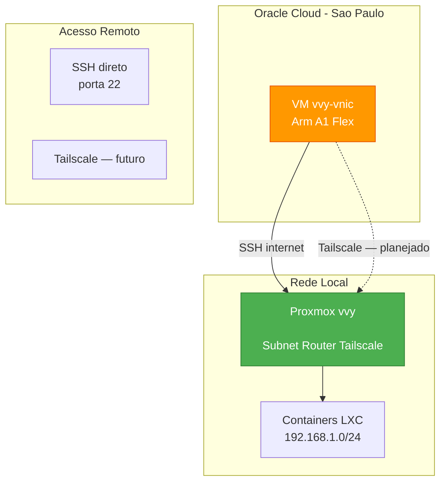

# Oracle Cloud Free Tier — VM vvy-vnic

[](LICENSE)

VM na **Oracle Cloud Free Tier** (São Paulo) que atua como extensão remota do homelab Proxmox vvy. Funciona como servidor de suporte, testes e serviços auxiliares — um nó externo à rede local, acessível via SSH direto e (futuramente) via Tailscale.

---

## Arquitetura



---

## Identificação

| Campo | Valor |
|---|---|
| Hostname | `vvy-vnic` |
| Plataforma | Oracle Cloud Infrastructure (OCI) |
| Region | São Paulo (sa-saopaulo-1) |
| Compartimento | mviniciusy (raiz) |
| Tenancy | <OCI_TENANCY_EMAIL> |
| Função | VM de suporte/teste — extensão remota do homelab vvy |
| Data de criação | 26 de julho de 2026 |

---

## Hardware

| Recurso | Especificação |
|---|---|
| Shape | `VM.Standard.A1.Flex` (Arm Ampere) |
| CPU | 2x Neoverse-N1 (aarch64) |
| RAM | 12 GB |
| Swap | 0 B |
| Disco | 200 GB (`/dev/sda`) |
| Disco usado | 2.2 GB (2%) |
| Virtualização | KVM (QEMU) |
| Firmware | UEFI 1.6.6 |

### Armazenamento — Particionamento

```
sda       200G  disk
├─sda1    199G  part /            (ext4, 2.2G usado)
├─sda15   99M   part /boot/efi    (vfat)
└─sda16   923M  part /boot        (ext4, 94M usado)
```

---

## Sistema Operacional

| Campo | Valor |
|---|---|
| OS | Ubuntu 24.04.4 LTS (Noble Numbat) |
| Kernel | `6.17.0-1018-oracle` (aarch64) |
| Arquitetura | arm64 / aarch64 |
| Timezone | UTC (Etc/UTC) — pendente ajustar para America/Sao_Paulo |
| Cloud-init | done (completo) |
| Oracle Cloud Agent | ativo (snap) |

---

## Rede

### IPs

| Tipo | IP | Observação |
|---|---|---|
| IP público | `<ORACLE_PUBLIC_IP>` | Efêmero — pode mudar se a VM for reiniciada |
| IP privado | `<ORACLE_PRIVATE_IP>/24` | VCN vvy-vcn, subnet-publica |
| Gateway | `10.0.0.1` | |
| DNS | `127.0.0.53` (systemd-resolved) | Search domain: `vvyvcn.oraclevcn.com` |
| MAC | `<ORACLE_VM_MAC>` | |
| Interface | `enp0s6` | MTU 9000 (jumbo frames) |

### VCN — Oracle Cloud

| Campo | Valor |
|---|---|
| Nome | `vvy-vcn` |
| CIDR | `<ORACLE_VCN_CIDR>` |
| Subnet | `subnet-publica` (`<ORACLE_SUBNET_CIDR>`) — pública |
| Route Table | `Default Route Table for vvy-vcn` |
| Internet Gateway | `ig-quick-action-IGW` |
| Route rule | `0.0.0.0/0` -> Internet Gateway |

### Security List — Ingress

| Source | Protocolo | Porta | Descrição |
|---|---|---|---|
| 0.0.0.0/0 | TCP | 22 | SSH |
| 0.0.0.0/0 | ICMP | 3,4 | Destino Inacessível: Fragmentação |
| <ORACLE_VCN_CIDR> | ICMP | 3 | Destino Inacessível |

> ICMP echo (ping) nao liberado no Security List.

### Security List — Egress

| Destination | Protocolo | Observação |
|---|---|---|
| 0.0.0.0/0 | All | Todo trafego de saida liberado |

---

## Acesso

### SSH (internet)

```bash
# A partir do CT 104 (Hermes):
ssh -i /root/.ssh/oracle-vm.key ubuntu@<ORACLE_PUBLIC_IP>

# A partir do notebook:
ssh -i <caminho-da-chave> ubuntu@<ORACLE_PUBLIC_IP>
```

| Item | Valor |
|---|---|
| Usuario | `ubuntu` (UID 1001) |
| Autenticacao | Chave SSH (RSA) + senha (cloud-init) |
| Senha | `<ORACLE_VM_PASSWORD>` (definida via cloud-init) |
| Porta | 22 |

### Chave SSH

| Item | Caminho |
|---|---|
| Chave privada (CT 104) | `/root/.ssh/oracle-vm.key` |
| Chave privada (servidor vvy) | `/mnt/pve/HD-WD500GB/Dados-WD500GB/Oracle/ssh-key-2026-07-25.key` |
| Chave publica (authorized_keys) | `ssh-rsa AAAAB3...ssh-key-2026-07-25` |

### Console Serial (OCI)

Usado para recuperacao quando SSH nao responde. Acesso via OCI Console Connection com chave SSH separada.

| Item | Caminho (servidor vvy) |
|---|---|
| Chave do console | `/mnt/pve/HD-WD500GB/Dados-WD500GB/Oracle/ssh-key-2026-07-26.key` |

---

## Firewall Interno (iptables INPUT)

| # | Target | Protocolo | Match | Observacao |
|---|---|---|---|---|
| 1 | ACCEPT | icmp | — | Inserido manualmente |
| 2 | ACCEPT | tcp | dpt:22 | Inserido manualmente |
| 3 | ACCEPT | all | state RELATED,ESTABLISHED | Oracle default |
| 4 | ACCEPT | icmp | — | Oracle default |
| 5 | ACCEPT | all | — | Oracle default |
| 6 | ACCEPT | tcp | state NEW dpt:22 | Oracle default |
| 7 | REJECT | all | — | reject-with icmp-host-prohibited |

---

## Software Instalado

| Software | Estado |
|---|---|
| Docker | NAO instalado |
| Snap | instalado (oracle-cloud-agent, core18, snapd) |
| cloud-init | completo |
| oracle-cloud-agent | ativo (snap) |

---

## Cloud-Init

Configuracao aplicada na criacao da VM:

```yaml
#cloud-config
ssh_pwauth: true
chpasswd:
  list: |
    ubuntu:<ORACLE_VM_PASSWORD>
  expire: false
```

---

## Configuracao OCI — Como Replicar

1. Criar VCN `vvy-vcn` (CIDR `<ORACLE_VCN_CIDR>`)
2. Criar subnet publica `subnet-publica` (`<ORACLE_SUBNET_CIDR>`)
3. Criar Internet Gateway e adicionar route rule `0.0.0.0/0` -> IG
4. Configurar Security List com Ingress TCP 22 (0.0.0.0/0)
5. Criar instancia: shape `VM.Standard.A1.Flex`, 2 OCPU, 12 GB RAM
6. Image: Ubuntu 24.04 LTS (Always Free Eligible)
7. Colar chave publica SSH na criacao
8. Adicionar cloud-init user-data com senha de emergencia

> **Importante:** O quick action "Conectar sub-rede publica a internet" da OCI cria IG + route rule de uma vez.

---

## Historico de Problemas

### Problema 1 — SSH inacessivel (2 instancias)

| Item | Detalhe |
|---|---|
| Sintoma | Porta 22 timed out, ping 100% packet loss |
| Causa raiz | Route Table da VCN sem regra `0.0.0.0/0` -> Internet Gateway |
| Correcao | Criar IG + route rule via quick action "Conectar sub-rede publica a internet" |

### Problema 2 — Console serial sem login

| Item | Detalhe |
|---|---|
| Sintoma | Console serial pede login mas nenhum usuario tem senha |
| Causa raiz | Imagem Ubuntu da Oracle usa autenticacao por chave apenas |
| Correcao | Recriar VM com cloud-init definindo senha para `ubuntu` |

---

## Proximos Passos

- [ ] Hardening: desabilitar PasswordAuthentication apos confirmar chave SSH
- [ ] Timezone: `America/Sao_Paulo`
- [ ] Instalar Docker + ferramentas (htop, btop, tmux, etc)
- [ ] Configurar Tailscale (integracao com homelab)
- [ ] Limpar regras iptables duplicadas
- [ ] Configurar IP reservado (em vez de efemero)
- [ ] Anti-idle: cron heartbeat
- [ ] Configurar UFW (camada adicional)
