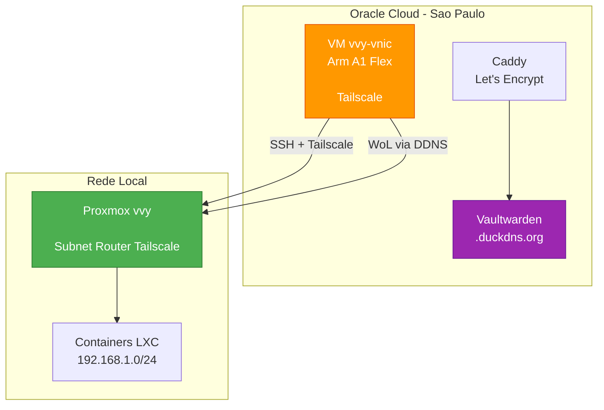

# Oracle Cloud Free Tier — VM vvy-vnic

[](LICENSE)

VM na **Oracle Cloud Free Tier** (São Paulo) que atua como extensão remota do homelab Proxmox vvy. Funciona como servidor de suporte, testes e serviços auxiliares — um nó externo à rede local, acessível via SSH direto e via Tailscale.

---

## Arquitetura



---

## Identificação

| Campo | Valor |
|---|---|
| Hostname | `vvy-vnic` |
| Plataforma | Oracle Cloud Infrastructure (OCI) |
| Region | São Paulo (sa-saopaulo-1) |
| Compartimento | mviniciusy (raiz) |
| Tenancy | <OCI_TENANCY_EMAIL> |
| Função | VM de suporte/teste — extensão remota do homelab vvy |
| Data de criação | 26 de julho de 2026 |

---

## Hardware

| Recurso | Especificação |
|---|---|
| Shape | `VM.Standard.A1.Flex` (Arm Ampere) |
| CPU | 2x Neoverse-N1 (aarch64) |
| RAM | 12 GB |
| Swap | 0 B |
| Disco | 200 GB (`/dev/sda`) |
| Virtualização | KVM (QEMU) |
| Firmware | UEFI 1.6.6 |

---

## Sistema Operacional

| Campo | Valor |
|---|---|
| OS | Ubuntu 24.04.4 LTS (Noble Numbat) |
| Kernel | `6.17.0-1018-oracle` (aarch64) |
| Arquitetura | arm64 / aarch64 |
| Timezone | UTC (Etc/UTC) — pendente ajustar para America/Sao_Paulo |
| Cloud-init | done (completo) |

---

## Rede

### IPs

| Tipo | IP | Observação |
|---|---|---|
| IP público | `<ORACLE_PUBLIC_IP>` | Efêmero — pode mudar se a VM for reiniciada |
| IP privado | `<ORACLE_PRIVATE_IP>/24` | VCN vvy-vcn, subnet-publica |
| IP Tailscale | `<TAILSCALE_ORACLE_VM_IP>` | `--accept-routes` ativo — enxerga LAN 192.168.1.0/24 |
| Gateway | `10.0.0.1` | |
| MAC | `<ORACLE_VM_MAC>` | |
| Interface | `enp0s6` | MTU 9000 (jumbo frames) |

### Security List — Ingress

| Source | Protocolo | Porta | Descrição |
|---|---|---|---|
| 0.0.0.0/0 | TCP | 22 | SSH |
| 0.0.0.0/0 | TCP | 80 | HTTP (Let's Encrypt + redirect) |
| 0.0.0.0/0 | TCP | 443 | HTTPS (Vaultwarden) |
| 0.0.0.0/0 | ICMP | 3,4 | Destino Inacessível: Fragmentação |
| <ORACLE_VCN_CIDR> | ICMP | 3 | Destino Inacessível |

### iptables Interno

Regras ACCEPT para 80/443 inseridas **antes** do REJECT catch-all (linha 7) e persistidas com `netfilter-persistent`.

> **Pitfall**: A imagem Ubuntu da Oracle vem com regra catch-all REJECT no iptables. Regras do UFW ficam DEPOIS do REJECT e não funcionam. Sempre usar `iptables -I INPUT 7` (insert, não append).

---

## Acesso

### SSH (internet)

```bash
ssh -i /root/.ssh/oracle-vm.key ubuntu@<ORACLE_PUBLIC_IP>
```

### SSH via Tailscale (Oracle VM → vvy)

A Oracle VM tem chave SSH autorizada no vvy (authorized_keys). Pode acessar o vvy diretamente:

```bash
# De dentro da Oracle VM:
ssh root@<TAILSCALE_VVV_IP>  # vvy via Tailscale
```

---

## Software Instalado (Jul/2026)

| Software | Versão | Função |
|---|---|---|
| Docker | 29.6.2 | Container runtime |
| Docker Compose | v5.3.1 | Orquestração |
| Tailscale | 1.98.9 | VPN mesh — `--accept-routes` ativo |
| fail2ban | 1.0.2 | Proteção SSH |
| wakeonlan | — | Envio de magic packet WoL |

---

## Serviços Ativos

### Vaultwarden

| Item | Valor |
|---|---|
| URL | `https://<DUCKDNS_SUBDOMAIN>.duckdns.org` |
| HTTPS | Caddy + Let's Encrypt automático |
| Container | `vaultwarden/server:latest` |
| Reverse Proxy | Caddy 2 (alpine) |
| Signups | Bloqueados (`SIGNUPS_ALLOWED=false`) |
| Compose | `/opt/vaultwarden/docker-compose.yml` |
| Caddyfile | `/opt/vaultwarden/Caddyfile` |
| Dados | `/opt/vaultwarden/data/` |
| Domínio | DuckDNS (`<DUCKDNS_SUBDOMAIN>.duckdns.org`) |
| Cron DuckDNS | `/etc/cron.d/duckdns` — a cada 5 min |

> Ver `oracle/vaultwarden/README.md` para documentação completa da stack.

### Anti-idle Oracle Cloud

| Item | Valor |
|---|---|
| Cron | `/etc/cron.d/anti-idle` |
| Ping Tailscale | a cada 30 min (tráfego de rede) |
| CPU 1 min/dia | 03:07 (mantém CPU > 20%) |

> A Oracle pode desligar VMs Always Free com CPU/rede/memória < 20% (p95) por 7 dias consecutivos.

### WoL — Acordar/Reiniciar vvy Remotamente

| Item | Valor |
|---|---|
| Script acordar | `/opt/wol/wake-vvy.sh` |
| Script reboot | `/opt/wol/reboot-vvy.sh` |
| Método | Magic packet → IP público de casa (vvy-server.ddns.net:9) → roteador → port forwarding → broadcast LAN |
| MAC do vvy | `<VVY_MAC>` |

> WoL não depende do Tailscale — funciona mesmo se o vvy estiver travado. Ver `docs/wake-on-lan.md` para detalhes completos.

### DuckDNS

| Item | Valor |
|---|---|
| Subdomínio | `<DUCKDNS_SUBDOMAIN>.duckdns.org` |
| Script | `/opt/duckdns/duckdns.sh` |
| Cron | `*/5 * * * *` em `/etc/cron.d/duckdns` |

---

## Histórico de Problemas

### Problema 1 — SSH inacessivel (2 instancias)

| Item | Detalhe |
|---|---|
| Sintoma | Porta 22 timed out, ping 100% packet loss |
| Causa raiz | Route Table da VCN sem regra `0.0.0.0/0` -> Internet Gateway |
| Correcao | Criar IG + route rule via quick action "Conectar sub-rede publica a internet" |

### Problema 2 — Console serial sem login

| Item | Detalhe |
|---|---|
| Sintoma | Console serial pede login mas nenhum usuario tem senha |
| Causa raiz | Imagem Ubuntu da Oracle usa autenticacao por chave apenas |
| Correcao | Recriar VM com cloud-init definindo senha para `ubuntu` |

### Problema 3 — Let's Encrypt challenge timeout

| Item | Detalhe |
|---|---|
| Sintoma | Caddy nao conseguia obter certificado — `Timeout during connect (likely firewall problem)` |
| Causa raiz | Security List da VCN sem portas 80/443 abertas |
| Correcao | Adicionar Ingress TCP 80 e 443 para 0.0.0.0/0 no Security List da VCN |

---

## Próximos Passos

- [ ] Hardening: desabilitar PasswordAuthentication apos confirmar chave SSH
- [ ] Timezone: `America/Sao_Paulo`
- [ ] Configurar IP reservado (em vez de efemero)
- [ ] Backup automático dos dados do Vaultwarden
