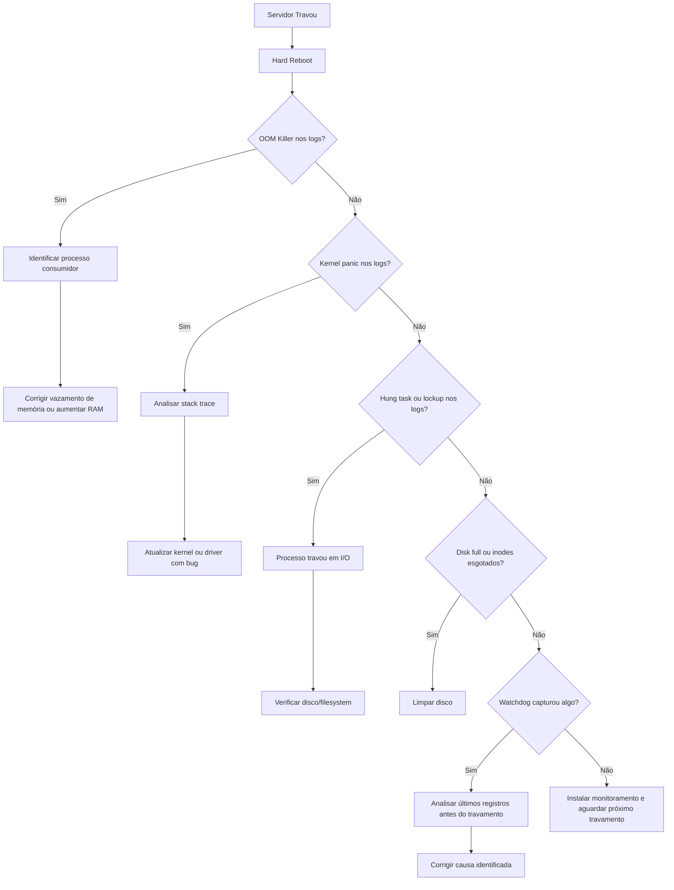

# 🔍 Plano de Diagnóstico - Servidor Linux Travando

## Sintoma
- Servidor Linux (VPS/dedicado) trava de forma intermitente
- Fica totalmente inacessível (nem SSH responde)
- Não desliga, apenas congela
- Só volta com hard reboot

---

## Causas Mais Prováveis

| # | Causa | Probabilidade | Indicador |
|---|-------|---------------|-----------|
| 1 | **OOM Killer / Falta de RAM** | Alta | Sistema sem swap ou swap cheio |
| 2 | **CPU 100% por processo descontrolado** | Alta | Load average alto antes do travamento |
| 3 | **Disk I/O saturado** | Média | Disco 100% ocupado ou I/O wait alto |
| 4 | **Kernel panic / bug de driver** | Média | Mensagens no `dmesg` / `kern.log` |
| 5 | **Problema de rede / firewall** | Baixa | Travamento só de conectividade, não do sistema |
| 6 | **Hardware defeituoso (RAM, disco)** | Baixa | Erros de ECC, bad sectors |

---

## Fase 1 - Investigação Imediata (após reboot)

Executar logo após o servidor voltar do hard reboot, antes que os logs sejam sobrescritos.

### 1.1 Verificar logs de kernel para OOM Killer
```bash
# Procurar evidências de OOM Killer
dmesg -T | grep -i "oom\|out of memory\|killed process"
journalctl -k --since "1 day ago" | grep -i "oom\|out of memory\|killed process"
```

### 1.2 Verificar mensagens de kernel panic ou erro
```bash
dmesg -T | grep -i "panic\|error\|bug\|hung_task\|lockup\|NMI"
journalctl -k --since "1 day ago" | grep -i "panic\|error\|bug\|hung_task\|lockup"
```

### 1.3 Verificar uso de memória e swap antes do travamento
```bash
# Verificar se swap está configurado
free -h
swapon --show
cat /proc/sys/vm/swappiness
```

### 1.4 Verificar espaço em disco
```bash
df -h
df -i  # inodes - pode travar se inodes esgotados
```

### 1.5 Verificar load average e processos pesados nos logs
```bash
# Últimos logs antes do travamento
journalctl --since "1 day ago" | tail -200
```

### 1.6 Verificar integridade do filesystem
```bash
# Verificar se há erros de filesystem nos logs
dmesg -T | grep -i "ext4\|xfs\|btrfs\|error\|corrupt\|remount.*ro"
```

---

## Fase 2 - Monitoramento Preventivo (instalar ANTES do próximo travamento)

O objetivo é capturar o estado do servidor momentos antes de ele travar, para que possamos identificar a causa após o reboot.

### 2.1 Script de monitoramento contínuo

Criar um script que registra o estado do sistema a cada 1 minuto em um arquivo de log persistente. Se o servidor travar, os últimos registros antes do travamento mostrarão o que estava acontecendo.

**Arquivo: `/usr/local/bin/server-watchdog.sh`**

```bash
#!/bin/bash
LOG="/var/log/watchdog/server-state.log"
mkdir -p /var/log/watchdog

# Rotacionar log se ficar muito grande
if [ -f "$LOG" ] && [ $(wc -l < "$LOG") -gt 10000 ]; then
    mv "$LOG" "${LOG}.old"
fi

echo "===== $(date '+%Y-%m-%d %H:%M:%S') =====" >> "$LOG"

# Memória
free -h >> "$LOG" 2>&1

# Swap
swapon --show >> "$LOG" 2>&1

# Load average e processos top 10 por CPU
uptime >> "$LOG" 2>&1
ps aux --sort=-%cpu | head -11 >> "$LOG" 2>&1

# Processos top 10 por memória
ps aux --sort=-%mem | head -11 >> "$LOG" 2>&1

# Disk I/O wait
cat /proc/stat | grep cpu >> "$LOG" 2>&1
iostat -x 1 1 >> "$LOG" 2>&1

# Espaço em disco
df -h >> "$LOG" 2>&1

# Conexões de rede
ss -s >> "$LOG" 2>&1

# Dmesg crítico dos últimos minutos
dmesg -T | tail -5 >> "$LOG" 2>&1

echo "" >> "$LOG"
```

### 2.2 Configurar cron para executar a cada 1 minuto
```bash
# Adicionar ao crontab do root
* * * * * /usr/local/bin/server-watchdog.sh
```

### 2.3 Configurar sysrq para emergências

O Magic SysRq permite tentar recuperar o sistema mesmo quando está travado, e gera logs úteis.

```bash
# Habilitar SysRq (1 = todas as funções, ou 176 para subset seguro)
echo 1 > /proc/sys/kernel/sysrq
echo "kernel.sysrq = 1" >> /etc/sysctl.conf

# Se o servidor travar, antes do hard reboot, tentar via console/IPMI:
# Alt+SysRq+t  -> dump de tarefas (mostra o que está travado)
# Alt+SysRq+m  -> dump de memória
# Alt+SysRq+e  -> SIGTERM para todos os processos
# Alt+SysRq+i  -> SIGKILL para todos os processos
# Alt+SysRq+s  -> sync discos
# Alt+SysRq+u  -> remontar discos como read-only
# Alt+SysRq+b  -> reboot seguro
```

### 2.4 Configurar watchdog por hardware (se disponível)
```bash
# Verificar se o servidor tem watchdog de hardware
ls /dev/watchdog*

# Se existir, instalar o daemon
apt install watchdog   # Debian/Ubuntu
yum install watchdog   # CentOS/RHEL

# Configurar /etc/watchdog.conf
# watchdog-device = /dev/watchdog
# interval = 10
# log-dir = /var/log/watchdog
# max-load-1 = 24
# min-memory = 1
# Se o sistema travar, o hardware watchdog reinicia automaticamente
```

---

## Fase 3 - Configurar persistência de logs

Por padrão, muitos sistemas guardam logs apenas em memória (especialmente com systemd). Se o servidor trava, logs em memória são perdidos.

### 3.1 Garantir que logs do kernel vão para disco
```bash
# Verificar configuração atual
cat /etc/rsyslog.conf | grep kern

# Garantir que kernel logs vão para arquivo persistente
# Adicionar ao /etc/rsyslog.conf se não existir:
kern.*                          /var/log/kern.log

# Reiniciar rsyslog
systemctl restart rsyslog
```

### 3.2 Configurar journald para persistência em disco
```bash
# Editar /etc/systemd/journald.conf
[Journal]
Storage=persistent
SystemMaxFileSize=50M
SystemMaxFiles=10

# Criar diretório de logs persistentes
mkdir -p /var/log/journal
systemd-tmpfiles --create --prefix /var/log/journal
systemctl restart systemd-journald
```

---

## Fase 4 - Verificações de Hardware

### 4.1 Teste de memória RAM
```bash
# Instalar memtester (teste em userspace, não precisa reiniciar)
apt install memtester
memtester 512M 1  # Testa 512MB por 1 pass

# Alternativa: agendar teste mais completo
# memtester 1G 3   # Testa 1GB por 3 passes

# NOTA: Para teste completo, usar memtest86+ no boot
```

### 4.2 Verificar erros de ECC na RAM
```bash
# Verificar se há erros de memória reportados pelo EDAC
grep -r . /sys/devices/system/edac/mc/ 2>/dev/null
edac-util -v 2>/dev/null
```

### 4.3 Verificar saúde do disco
```bash
# Instalar smartmontools
apt install smartmontools

# Verificar atributos SMART
smartctl -a /dev/sda
smartctl -a /dev/vda  # Para VPS com disco virtual

# Procurar por:
# - Reallocated_Sector_Ct > 0
# - Current_Pending_Sector > 0
# - Offline_Uncorrectable > 0
```

---

## Fase 5 - Mitigações Imediatas

Enquanto não identificamos a causa raiz, aplicar estas mitigações:

### 5.1 Configurar swap (se não existir)
```bash
# Verificar se tem swap
free -h

# Se não tem swap, criar um arquivo de swap
fallocate -l 2G /swapfile
chmod 600 /swapfile
mkswap /swapfile
swapon /swapfile
echo '/swapfile none swap sw 0 0' >> /etc/fstab

# Ajustar swappiness (0 = nunca usa swap, 10 = usa com pouca RAM)
echo 10 > /proc/sys/vm/swappiness
echo 'vm.swappiness=10' >> /etc/sysctl.conf
```

### 5.2 Configurar OOM score para proteger processos críticos
```bash
# Evitar que o OOM killer mate processos essenciais
echo -1000 > /proc/<PID_do_processo_critico>/oom_score_adj
```

### 5.3 Configurar limites de recursos
```bash
# Verificar limites atuais
ulimit -a

# Configurar limites no /etc/security/limits.conf se necessário
```

---

## Fluxo de Diagnóstico



---

## Checklist de Execução

- [ ] **Fase 1**: Executar comandos de investigação imediata após reboot
- [ ] **Fase 2**: Instalar script de monitoramento watchdog + cron
- [ ] **Fase 2**: Configurar SysRq para emergências
- [ ] **Fase 2**: Configurar watchdog de hardware se disponível
- [ ] **Fase 3**: Garantir persistência de logs em disco
- [ ] **Fase 4**: Executar testes de hardware
- [ ] **Fase 5**: Aplicar mitigações imediatas (swap, limites)
- [ ] Aguardar próximo travamento e analisar logs do watchdog
- [ ] Identificar e corrigir causa raiz

---

## Comando Rápido de Diagnóstico (copiar e colar após reboot)

```bash
echo "=== OOM CHECK ===" && dmesg -T | grep -i "oom\|killed process" | tail -20 && \
echo "=== KERNEL ERRORS ===" && dmesg -T | grep -i "panic\|error\|bug\|hung_task\|lockup" | tail -20 && \
echo "=== MEMORY ===" && free -h && \
echo "=== SWAP ===" && swapon --show && \
echo "=== DISK ===" && df -h && \
echo "=== INODES ===" && df -i && \
echo "=== TOP CPU ===" && ps aux --sort=-%cpu | head -11 && \
echo "=== TOP MEM ===" && ps aux --sort=-%mem | head -11 && \
echo "=== UPTIME ===" && uptime && \
echo "=== LAST JOURNAL ===" && journalctl --since "1 day ago" | tail -50
```
